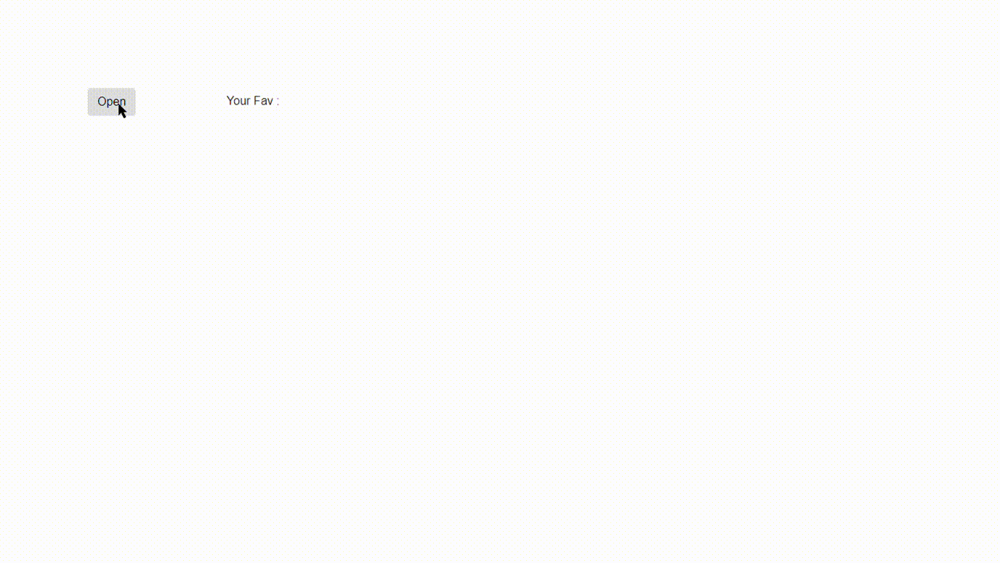

## custom-angular-dialog

This is a simple, easy, small library for creating dynamic dialogs with angular. This can be easily handled by using a `boolean` with customizable header and body content.

#### Installation

```
$ npm install custom-angular-dialog --save
```

Import `DialogModule` into your AppModule so that your app knows how to render `<app-dialog>`.

```
  import { DialogModule } from 'custom-angular-dialog';
  import { NO_ERRORS_SCHEMA } from "@angular/core";
...
```

```
imports:[
    ...
...
DialogModule,
...
],
schemas: [NO_ERRORS_SCHEMA]
```

Then your app should look something like this:

```
<button (click)="showDialog = !showDialog">Open</button>
<label>Your Fav : {{tDialog}}</label>
<!-- dialog content -->

<app-dialog [(visible)]="showDialog" [width]="20" [height]="20" [headerColor]="'#34a0e7'">
<dialog-header>Alert !</dialog-header>
<dialog-body>
  <input placeholder="Trending Dialog ?" [(ngModel)]="tDialog" type="text" />
  <button (click)="showDialog = !showDialog">Close</button>
</dialog-body>
</app-dialog>
```

#### `<dialog-header>` ,`<dialog-body>`

Both are optional and each can be used alone.

Any HTML tags including ``, `<input>`, etc... can be included inside <dialog-body>

#### Input parameters `[width]` and `[height]`.

Both are optional parameters and is defaulted to `20% both` of whole dialog.

The values should be in `percentage(%)`.

Parameter `[headerColor]`

Color is defaulted to `34a0e7`.

It can be used to set the color of Default header and the color can be in names, or RGB, HEX, HSL, RGBA, HSLA values.


